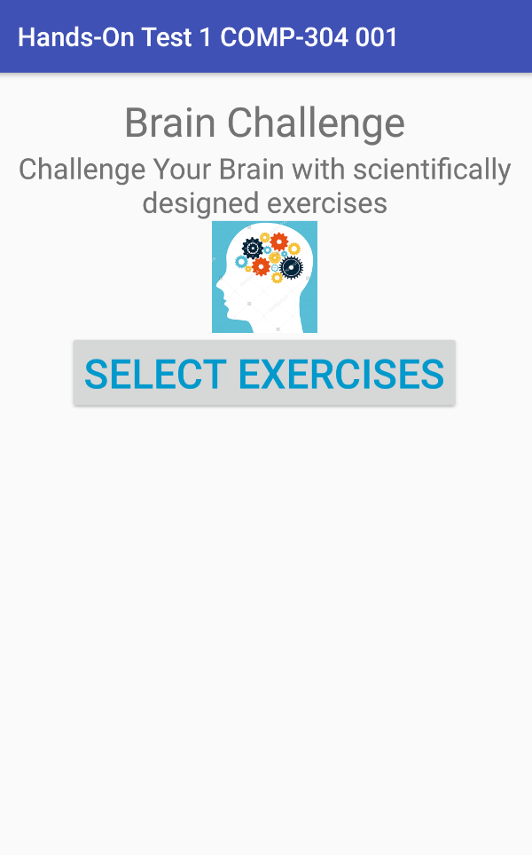
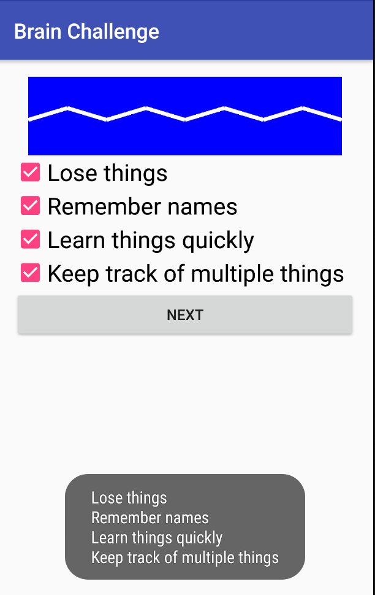
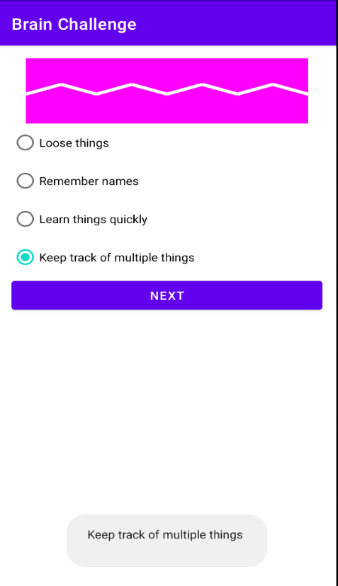

# Hands-On TEST 1

## Exercise #1

Create an Android app that allows users to select exercises which help
people to challenge their brain. The first activity simply displays the
**logo** and a **button**. The user should click on the button to
display the second activity. The second activity allows the user to
select the types of exercises as shown in the picture below. It uses a
set of **check boxes** **or** **radio buttons** to allow the user to
select which exercises he/she wants.

**Use check boxes** (picture in the middle) **if your first name starts
with a letter from A-N inclusive, otherwise, use RadioButton controls**
(picture on the right). When user clicks on the button **Next**, the
activity should display the selected type(s) of exercises in a **Toast**
message.

The second activity should also **display an image** drawn on an image
view. You can download or use any suitable image which depicts brain
image.

> (100 marks)
